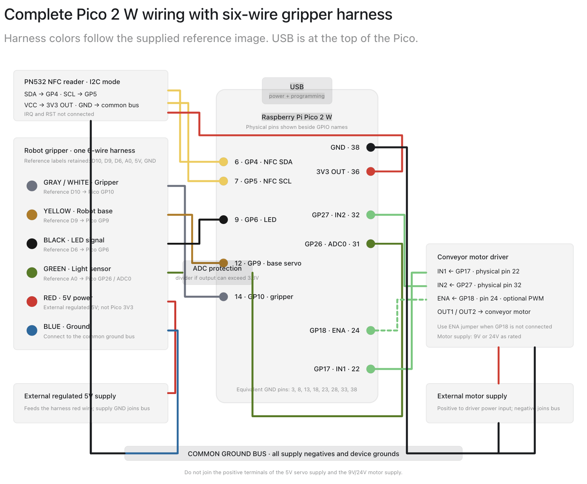

# Gripper Conveyor Sorting

The source is divided into three sets:

- `common/`: platform-independent sorting logic and UID mapping.
- `pi/`: Raspberry Pi GPIO and PN532 implementations plus CPython dependencies.
- `pico/`: Raspberry Pi Pico 2 W MicroPython implementations.

Run the Raspberry Pi version from this directory with:

```sh
PYTHONPATH=common:pi python3 common/main.py
```

For deployment, combine the files from `common/` with the files for the target platform.

## Pico wiring


