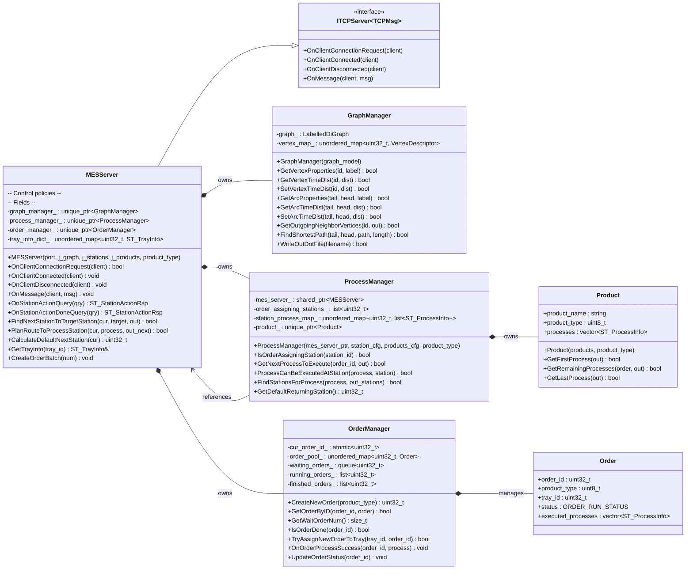

# ReconfigManus

A lab-scale Reconfigurable Manufacturing System (RMS) built with Fischertechnik building blocks.

> Developed by *Bohan Leng*

## Quick Start

### Clone the repository and submodules
```shell
git clone --recursive https://github.com/lengbh/ReconfigManus.git
cd ReconfigManus
```

### Install Dependencies

On MacOS Linux, it is recommended to use [`brew`](https://brew.sh) to install dependencies.

After installing `brew`, run:

```shell
brew install cmake boost pybind11 python nlohmann-json
```

### Build
Then build 
- MES Server,
- TCPConn library for MES Server,
- Pybind library to be copied to python DES Engine side.

Take `brew` managed packages for example,
```shell
cmake -S . -B cmake-build-release \
  -DCMAKE_BUILD_TYPE=Release \
  -DPython3_ROOT_DIR="$(brew --prefix python)" \
  -DPython3_EXECUTABLE="$(brew --prefix python)/bin/python3"
  
cmake --build cmake-build-release --config Release
```

### Run MES Server
```shell
cd bin
./MESServer
```
Here check `mes_server_cfg.json` for configuration options.

## MESServer
### Dependencies
- [`TCPConn`](https://github.com/lengbh/TCPConn)
- [`boost_graph`](https://www.boost.org/doc/libs/latest/libs/graph/doc/index.html)
- [`nlohmann_json`](https://github.com/nlohmann/json)

### Classes

Below is a high-level class diagram highlighting the MESServer and its core collaborators. The diagram focuses on ownership and key relationships relevant to MES operations, networking, graph navigation, order handling, and product/process logic.



- MESServer extends `TCPConn::ITCPServer` interface to provide communication to physical production settings or [the Digital Twin simulation](https://github.com/lengbh/GraphDesEngine), while delegating graph navigation to GraphManager, process logic to ProcessManager, and order lifecycle to OrderManager.
- GraphManager manages a labelled directed graph (using `boost::adjacency_list`) used for routing, timing, path calculation. 
- ProcessManager owns a Product definition used to derive process steps for orders and maintains the list of machine capabilities.
- OrderManager manages the lifecycle of Order objects and assigns them to trays.

### Configurations

The `MESServer` reads a single JSON configuration file at startup (default name: `mes_server_cfg.json`). A custom path can also be provided as the first program argument when launching the server.

Fields:
- `mes_service.bind_port` (uint16)
  - TCP port that the MES server binds to for client connections (physical cells or Digital Twin).

- `production_system.graph_file` (string, path)
  - Path to the production system directed-graph model JSON.
  - Used by `GraphManager` for routing, timing, and path calculation.
  - Relative paths are resolved from the current working directory when you start the app.

- `production_system.capabilities_file` (string, path)
  - Path to the station/machine capabilities JSON (which processes each station can perform).
  - Consumed by `ProcessManager` to map processes to stations.

- `product_info.products_file` (string, path)
  - Path to the product catalogue JSON defining products, their `product_type` ID, and ordered process lists.

- `product_info.product_type` (uint8)
  - Which product variant to produce by default when creating orders at startup.
  - Must correspond to a valid `product_type` defined in `products_file`.

### Usage
Run the server with:
- `./MESServer` (using the default config file path)
- `./MESServer /path/to/mes_server_cfg.json`

for the loaded generated `.dot` graph figure, could convert with [`graphviz`](https://graphviz.org):
- `dot -Tpdf system_graph.dot -o system_graph.pdf`
- `dot -Tpng system_graph.dot -o system_graph.png`

### Note
The protocol definition `mes_server_def.h` should be synced to the Digital Twin simulation and transcribed to python to support the communication.